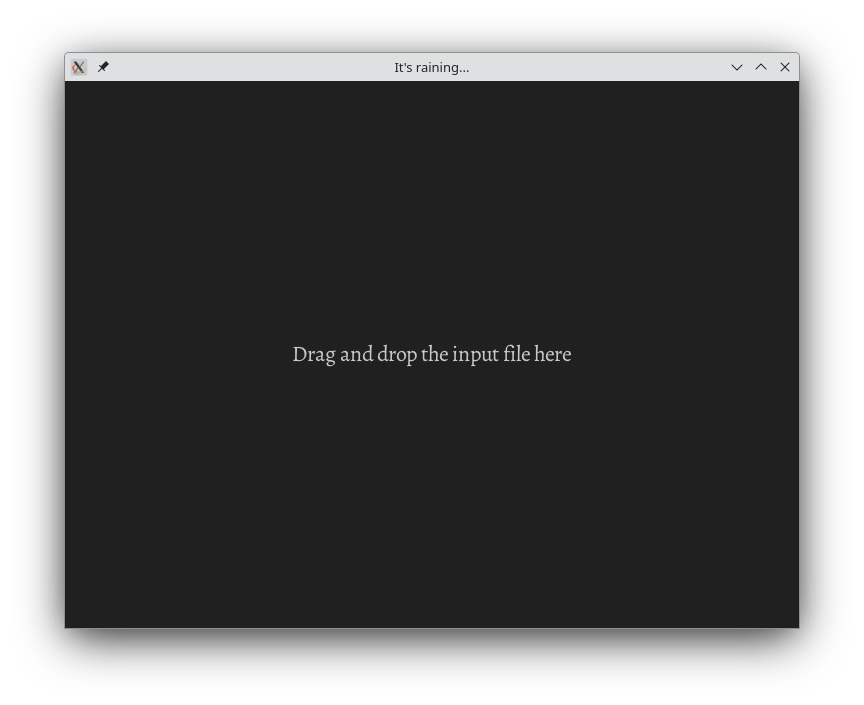
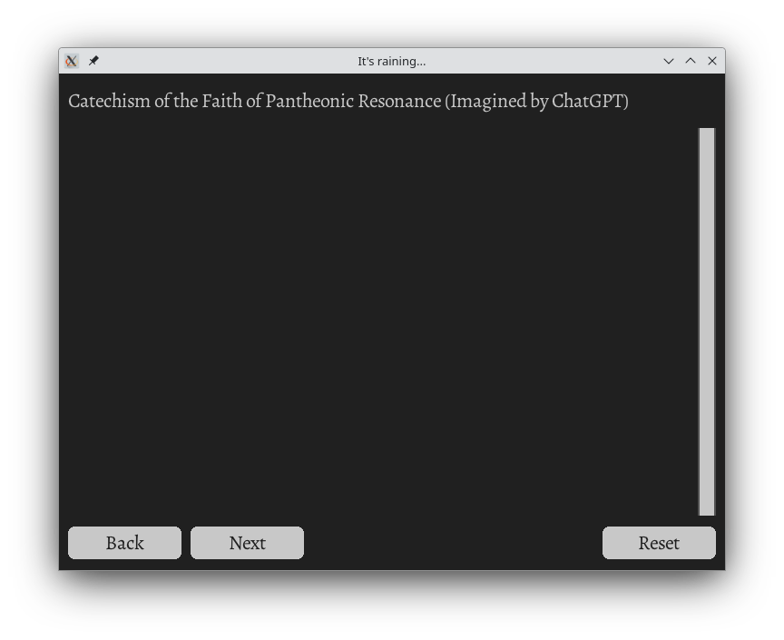
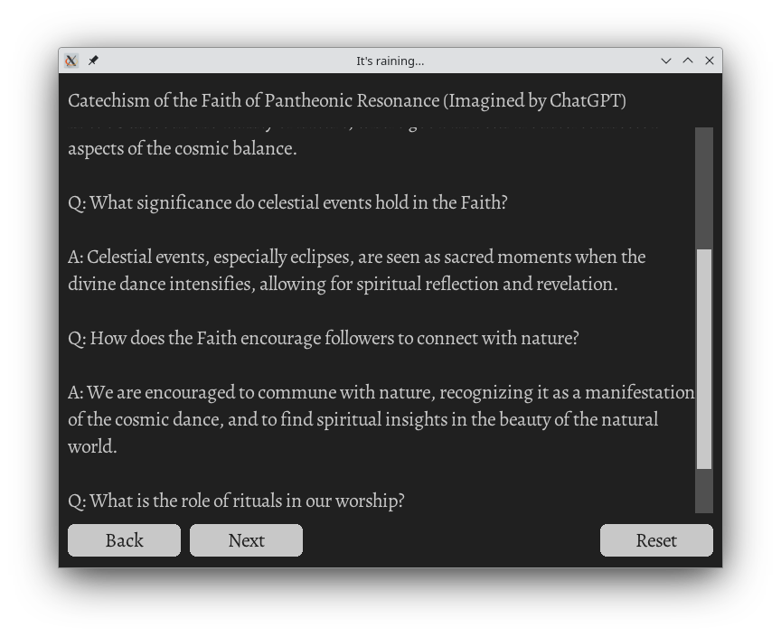
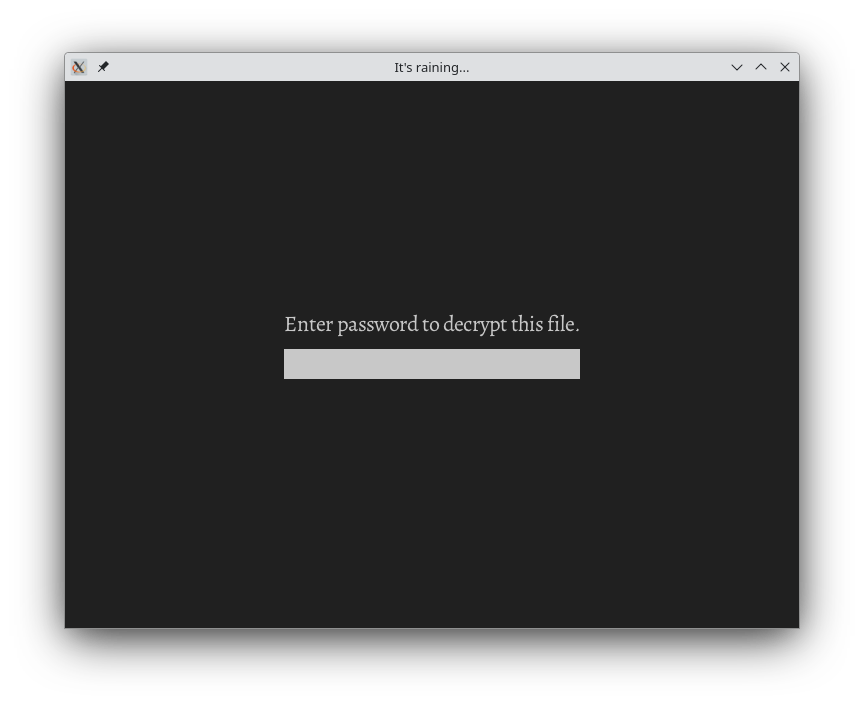

# Introduction
This introduces an app whose purpose is to help people learn a catechism and/or a ceremonial text.

The basic idea is that the user would use the app to step through the text, learning each line as it comes and perhaps trying to speak the next line out loud before advancing.

# Usage

On loading the app, the user is greeted with a screen, shown below, asking them to drag and drop a text file containing the document they wish to learn.  More details about the required formatting of this document can be found below.

{width=65%}

Dragging and dropping such a file onto the window leads to the screen shown in figure 2. Note that this screen is shown for a catechism imagined by ChatGPT for a purely fictional religion.

{width=65%}

The user then steps through the text using the "Next" and "Back" buttons, and may restart at the beginning of the text with the "Reset" button.

{width=65%}

# Protection of secrets
It is often the case that texts that users wish to learn are private or secret, perhaps due to vows made to a lodge.  For this reason this application allows for the decryption of specially encrypted documents.

The encryption used in this application is AES-256, and is considered state of the art.

{width=65%}

Entering the wrong password will return the user to the password screen.

The correct password opens the document as for an unecrypted text (see figure 2).

# Format of the input file
The text file (either unencrypted or after decryption) is expected to follow a very simple format.

The first line provides the title of the document, such as the one shown in figure 2. The remainder of the file is then divided line-by-line to be served up to the user one at a time as they click through the text.

